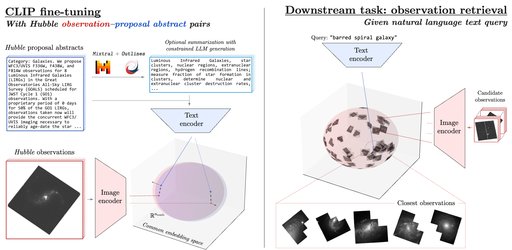

# PAPERCLIP: Associating Astronomical Observations and Natural Language with Multi-Modal Models<!-- omit from toc -->

[Siddharth Mishra-Sharma](mailto:smsharma@mit.edu), Yiding Song, and Jesse Thaler

[](https://opensource.org/licenses/MIT)
[](https://arxiv.org/abs/24xx.xxxxx)



## Contents<!-- omit from toc -->

- [Abstract](#abstract)
- [Paper draft](#paper-draft)
- [Requirements](#requirements)
- [Code overview](#code-overview)
- [Citation](#citation)


## Abstract

We present PAPERCLIP (Proposal Abstracts Provide an Effective Representation for Contrastive Language-Image Pre-training), a method which associates astronomical observations imaged by telescopes with natural language using a neural network model. The model is fine-tuned from a pre-trained Contrastive Language-Image Pre-training (CLIP) model using successful observing proposal abstracts and corresponding downstream observations, with the abstracts optionally summarized via guided generation using large language models (LLMs). Using observations from the Hubble Space Telescope (HST) as an example, we show that the fine-tuned model embodies a meaningful joint representation between observations and natural language through tests targeting image retrieval (i.e., finding the most relevant observations using natural language queries) and description retrieval (i.e., querying for astrophysical object classes and use cases most relevant to a given observation). Our study demonstrates the potential for using generalist foundation models rather than task-specific models for interacting with astronomical data by leveraging text as an interface.

## Paper draft

[Link to paper draft](https://github.com/smsharma/HubbleCLIP/blob/main-pdf/paper/hubble_paperclip.pdf). The PDF is compiled automatically from the `main` branch into the `main-pdf` branch on push.

## Requirements

The Python environment is defined in `environment.yml`. To create the environment run e.g.,
``` sh
mamba env create --file environment.yaml
```

## Code overview


## Citation

If you use this code, please cite our paper:

```
@article{mishra2024paperclip,
  title={PAPERCLIP: Associating Astronomical Observations and Natural Language with Multi-Modal Models},
  author={Mishra-Sharma, Siddhart and Song, Yiding and Thaler, Jesse},
  journal={arXiv preprint arXiv:24xx.xxxxx},
  year={2024}
}
```